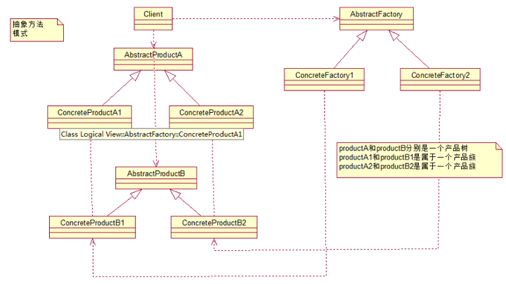

# 抽象工厂模式 - Abstract Factory Pattern
    

## 概述
    Provide an interface for creating families of related or dependent objects without specifyingtheir concrete classes.
    为创建一组相关或相互依赖的对象提供一个接口，而且无须指定它们的具体类
    


## 实现

```java

```

## 类图



## 优缺点

### 优点

* 
>

### 缺点

*
>


## 使用场景

## 注意事项

## 源码分析

```java

```
    

