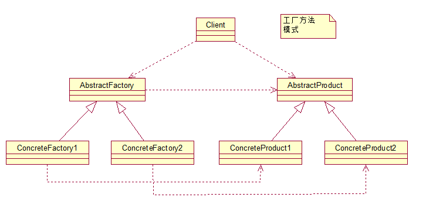

# 工厂方法模式 - Factory Method Pattern

## 概述

    Define an interface for creating an object,but let subclasses decide which class to instantiate.Factory Method lets a class defer instantiation to subclasses.
    定义一个用于创建对象的接口，让子类决定实例化哪一个类。工厂方法使一个类的实例化延迟到其子类

## 实现

```java
/**
 * 抽象工厂.
 * 抽象方法createProduct用于生产产品T(继承与Product)
 */
public abstract class AbstractFactory {
    public abstract <T extends Product> T createProduct(Class<T> c);
}

/**
 * 工厂方法类 - 继承AbstractFactory.
 * 具体实现createProduct方法.
 */
public class ProductFactory extends AbstractFactory{
    @Override
    public <T extends Product> T createProduct(Class<T> c) {
        Product product=null;
        try {
            product = (Product)Class.forName(c.getName()).newInstance();
        } catch (Exception e) {
            e.printStackTrace();
        }
        return (T)product;
    }
}

/**
 * 抽象产品类
 */
public abstract class Product {

    public void method1(){
    }
    public abstract void method2();
}

public class Product1 extends Product {

    @Override
    public void method1() {
        System.out.println("产品1 - method1");
    }

    @Override
    public void method2() {
        System.out.println("产品1 - method2");
    }
}

public class Product2 extends Product {
    @Override
    public void method1() {
        System.out.println("产品2 - method1");
    }

    @Override
    public void method2() {
        System.out.println("产品2 - method2");
    }
}

public class Client {
    public static void main(String[] args) {
        AbstractFactory factory = new ProductFactory();
        Product product1 = factory.createProduct(Product1.class);
        Product product2 = factory.createProduct(Product2.class);
        product1.method1();
        product1.method2();
        product2.method1();
        product2.method2();
    }
}
```

## 类图


## 优点

* 结构清晰,封装性好
>一个对象创建是有条件约束的，如一个调用者需 要一个具体的产品对象，只要知道这个产品的类名（或约束字符串）就可以了，不用知道创建对象的艰辛过程，降低模块间的耦合

* 扩展性高
> 在增加产品类的情况下，秩序扩展产品类，工厂类不用任何修改就可完成系统扩展

* 屏蔽产品类
>产品类的实现如何变化，调用者都不需要关心，它只需要关心产品的接口，只要接口保持不变，系统中的上层模块就不要发生变化

* 解耦框架
>高层模块值需要知道产品的抽象类，其他的实 现类都不用关心，符合迪米特法则，我不需要的就不要去交流；
 也符合依赖倒置原则，只依赖产品类的抽象；
 当然也符合里氏替换原则，使用产品子类替换产品父类

## 使用场景

注意事项工厂方法模式在项目中使用得非常频繁，以至于很多代码中都包含工厂方法模式。该模
式几乎尽人皆知，但不是每个人都能用得好。熟能生巧，熟练掌握该模式，多思考工厂方法
如何应用，而且工厂方法模式还可以与其他模式混合使用（例如模板方法模式、单例模式、
原型模式等），变化出无穷的优秀设计，这也正是软件设计和开发的乐趣所在


## 源码分析
   JDK中的`java.util.Calendar`采用的就是简单工厂模式
```java
public abstract class Calendar implements Serializable, Cloneable, Comparable<Calendar> {
    // ...
    public static Calendar getInstance(Locale aLocale)
    {
        return createCalendar(defaultTimeZone(aLocale), aLocale);
    }

    private static Calendar createCalendar(TimeZone zone,
                                           Locale aLocale)
    {
        CalendarProvider provider =
                LocaleProviderAdapter.getAdapter(CalendarProvider.class, aLocale)
                        .getCalendarProvider();
        if (provider != null) {
            try {
                return provider.getInstance(zone, aLocale);
            } catch (IllegalArgumentException iae) {
                // fall back to the default instantiation
            }
        }

        Calendar cal = null;

        if (aLocale.hasExtensions()) {
            String caltype = aLocale.getUnicodeLocaleType("ca");
            if (caltype != null) {
                cal = switch (caltype) {
                    case "buddhist" -> new BuddhistCalendar(zone, aLocale);
                    case "japanese" -> new JapaneseImperialCalendar(zone, aLocale);
                    case "gregory"  -> new GregorianCalendar(zone, aLocale);
                    default         -> null;
                };
            }
        }
        if (cal == null) {
            if (aLocale.getLanguage() == "th" && aLocale.getCountry() == "TH") {
                cal = new BuddhistCalendar(zone, aLocale);
            } else if (aLocale.getVariant() == "JP" && aLocale.getLanguage() == "ja"
                    && aLocale.getCountry() == "JP") {
                cal = new JapaneseImperialCalendar(zone, aLocale);
            } else {
                cal = new GregorianCalendar(zone, aLocale);
            }
        }
        return cal;
    }
    // ...
}

public class BuddhistCalendar extends GregorianCalendar {
    //...
}

public class GregorianCalendar extends Calendar {
    //...
}

public class JapaneseImperialCalendar extends Calendar {
    //...
}

```
    

