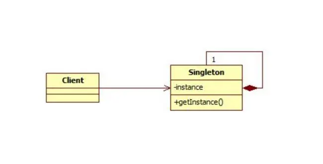

# 单例模式 - Singleton Pattern

## 概述

    Ensure a class has only one instance, and provide a global point of access to it.
    确保某一个类只有一个实例，而且自行实例化并向整个系统提供这个实例

## 类图


    
## 分类

### [饿汉式](../../src/main/java/com/naruto/designpatterns/creative/singleton/hungry/Singleton.java)  - 可用,容易造成内存浪费

    类装载时就实例化,分为：静态变量和静态代码快
```java
/**
 * 饿汉式 - 静态变量
 */
public class Singleton {
  private static Singleton instance =new Singleton();
  private Singleton(){
  }
  public static Singleton getInstance(){
    return instance;
  }
}

/**
 * 饿汉式 - 静态代码快
 */
public class Singleton{
  private static Singleton instance;
  static {
    instance = new Singleton();
  }
  private Singleton(){
  }
  public static Singleton getInstance(){
    return instance;
  }
}
```
* 优点
    * 写法简单，类装载时就实例化，避免线程同步问题(线程安全问题)

* 缺点
    * 类装载时就实例化，没有懒加载，容易造成内存浪费.
    * 它基于 classloader 机制避免了多线程的同步问题，不过，instance 在类装载时就实例化，虽然导致类装载的原因有很多种，在单例模式中大多数都是调用 getInstance 方法，
    但是也不能确定有其他的方式（或者其他的静态方法）导致类装载，这时候初始化 instance 显然没有达到 lazy loading 的效果。

### 懒汉式
* [线程不安全](../../src/main/java/com/naruto/designpatterns/creative/singleton/lazy/Singleton.java) - 不可用，线程不安全
  * 优点
    * 起到了懒加载（lazy loading）的作用
  * 缺点
     * 线程不安全，只能在单线程下使用
```java
/**
 * 懒汉式-线程不安全
 *
 */
public class Singleton {
    private static Singleton instance;
    private Singleton() {
    }
    public static Singleton getInstance() {
        if (instance == null) {
            instance = new Singleton();
        }
        return instance;
    }
}
```
* [线程安全同步方法](../../src/main/java/com/naruto/designpatterns/creative/singleton/lazy/Singleton2.java) - 不推荐，效率低
  * 优点
    * 线程安全，懒加载（第一次调用才初始化，避免内存浪费）
  
  * 缺点
    * 必须加锁 synchronized 才能保证单例，但加锁会影响效率，效率太低
```java
/**
 * 懒汉式-线程安全
 */
public class Singleton2 {
    private static Singleton2 instance;

    private Singleton2() {
    }

    public static synchronized Singleton2 getInstance() {
        if (instance == null) {
            instance = new Singleton2();
        }
        return instance;
    }
}
```

### [双重检查锁](../../src/main/java/com/naruto/designpatterns/creative/singleton/dcl/Singleton.java) - 推荐使用
* 优点
  * 线程安全，懒加载，效率较高

* 缺点
  * 多次判断，实现较为复杂
  * 由于 Java 内存模型的限制，可能会出现指令重排的问题，需要使用 volatile 关键字来解决

```java
/**
 * 双重校验锁 - DCL(double-checked locking)
 */
public class Singleton {
    
    // volatile 关键字可以确保 singleton 变量的可见性和有序性
    private static volatile Singleton singleton;

    private Singleton() {
    }

    public static Singleton getInstance() {
        if (singleton == null) {
            synchronized (Singleton.class) {
                if (singleton == null) {
                    singleton = new Singleton();
                }
            }
        }
        return singleton;
    }
}

```
### [静态内部类](../../src/main/java/com/naruto/designpatterns/creative/singleton/sic/Singleton.java) - 推荐使用

* 优点
  * 懒加载(静态内部类不会立即实例化，而是在调用getSingleton()时才会装载静态内部类,从而完成Singleton的实例化)
  * 线程安全(类装载机制来保证初始化实例时只有一个线程,类的静态属性只有第一次加载类的时候才初始化,JVM帮助保证了线程的安全性,在类进行初始化时，别的线程无法进入.)
  * 效率高

* 缺点
  * 不易理解： 相比于饿汉式和懒汉式，静态内部类单例模式的实现方式可能不太容易理解；
  * 无法传递参数： 静态内部类单例模式的构造函数是私有的，无法传递参数。如果需要传递参数，需要使用其他方式实现

```java
/**
 * 静态内部类
 */
public class Singleton {
    private Singleton() {
    }
    private static class SingletonHolder {
        private static final Singleton INSTANCE = new Singleton();
    }

    public static Singleton getInstance() {
        return Singleton.SingletonHolder.INSTANCE;
    }
}
```

### [枚举](../../src/main/java/com/naruto/designpatterns/creative/singleton/enums/Singleton.java) - 推荐使用

* 优点
  * 线程安全，简单明了： 枚举单例模式的实现非常简单，而且可以保证线程安全和实例的唯一性。
  * 序列化安全： 由于枚举实例在 JVM 中是唯一的，因此可以保证序列化和反序列化的安全性。
  * 防止反射攻击： 枚举实例在 JVM 中是唯一的，因此可以避免反射攻击。
* 缺点
  * 不支持延迟加载：因为枚举类型的实例在类加载时就已经被创建了。
  * 不能继承其他类 ：因为枚举类型默认继承了Enum类。
```java
/**
 * 枚举类
 */
public enum Singleton {
    INSTANCE;

    // 随便什么方法
    public void doSomething() {
    }
}
```

## 单例优缺点

### 优点
* 由于单例模式在内存中只有一个实例，减少了内存开支，特别是一个对象需要频繁地创建、销毁时，而且创建或销毁时性能又无法优化，单例模式的优势就非常明显
* 由于单例模式只生成一个实例，所以减少了系统的性能开销，当一个对象的产生需要比较多的资源时，如读取配置、产生其他依赖对象时，
  则可以通过在应用启动时直接产生一个单例对象，然后用永久驻留内存的方式来解决
* 单例模式可以避免对资源的多重占用，例如一个写文件动作，由于只有一个实例存在内存中，避免对同一个资源文件的同时写操作
* 单例模式可以在系统设置全局的访问点，优化和共享资源访问，例如可以设计一个单例类，负责所有数据表的映射处理

### 缺点
* 单例模式一般没有接口，扩展很困难，若要扩展，除了修改代码基本上没有第二种途径可以实现。单例模式为什么不能增加接口呢？因为接口对单例模式是没有任何意义的，它
  要求“自行实例化”，并且提供单一实例、接口或抽象类是不可能被实例化的。当然，在特殊情况下，单例模式可以实现接口、被继承等，需要在系统开发中根据环境判断
* 单例模式对测试是不利的。在并行开发环境中，如果单例模式没有完成，是不能进行测试的，没有接口也不能使用mock的方式虚拟一个对象
* 单例模式与单一职责原则有冲突。一个类应该只实现一个逻辑，而不关心它是否是单例的，是不是要单例取决于环境，单例模式把“要单例”和业务逻辑融合在一个类中

## 单例模式的使用场景
    在一个系统中，要求一个类有且仅有一个对象，如果出现多个对象就会出现“不良反 应”，可以采用单例模式，具体的场景如下：
* 要求生成唯一序列号的环境；
* 在整个项目中需要一个共享访问点或共享数据，例如一个Web页面上的计数器，可以 不用把每次刷新都记录到数据库中，使用单例模式保持计数器的值，并确保是线程安全的；
* 创建一个对象需要消耗的资源过多，如要访问IO和数据库等资源；
* 需要定义大量的静态常量和静态方法（如工具类）的环境，可以采用单例模式（当然，也可以直接声明为static的方式）

## 单例模式的注意事项
* 在高并发情况下,请注意单例模式的线程同步问题
* 需要考虑对象的复制情况,最好方法就是单例类不要实现Cloneable接口

## 源码分析
  JDK中的`java.lang.Runtime`采用的就是饿汉式的单例模式
```java
public class Runtime {
  private static final Runtime currentRuntime = new Runtime();

  /**
   * Returns the runtime object associated with the current Java application.
   * Most of the methods of class {@code Runtime} are instance
   * methods and must be invoked with respect to the current runtime object.
   *
   * @return the {@code Runtime} object associated with the current
   *          Java application.
   */
  public static Runtime getRuntime() {
    return currentRuntime;
  }

  /** Don't let anyone else instantiate this class */
  private Runtime() {
  }
  // ...
}
```

