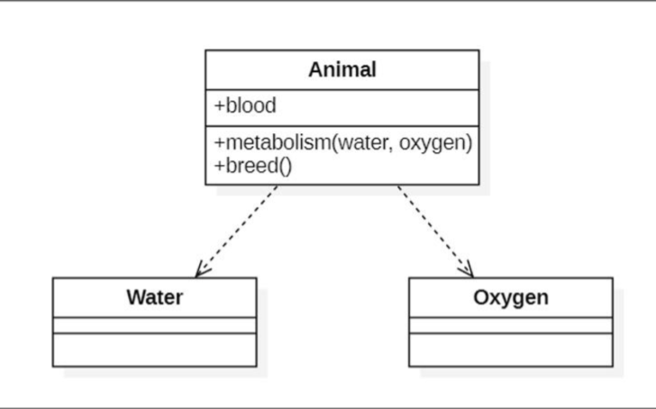

# UML
    Unified Modeling Language 统一建模语言,是用来对软件密集系统进行可视化建模的一种语言，
    一种用于软件系统设计和分析的语言工具,用于帮助软件开发人员思考和记录思路的结果.
    UML的定义包括UML语义和UML表示法两个元素,本身是一套符号的规定,就像数学符号和化学符号一样，
    这些符号用于描述软件模型中的各个元素，比如类、接口、实现、泛化、依赖、组合、聚合等

## 作用
    
    UML的目标是以面向对象图的方式来描述任何类型的系统，具有很宽的应用领域。其中最常用的是建立软件系统的模型，
    但它同样可以用于描述非软件领域的系统，如机械系统、企业机构或业务过程，以及处理复杂数据的信息系统、具有实时要求的工业系统或工业过程等。
    总之，UML是一个通用的标准建模语言，可以对任何具有静态结构和动态行为的系统进行建模，而且适用于系统开发的不同阶段，从需求规格描述直至系统完成后的测试和维护

## 特点
* UML统一了各种方法对不同类型的系统、不同开发阶段以及不同内部概念的不同观点，从而有效消除了各种建模语言之间不必要的差异。它实际上是一种通用的建模语言，可以为许多面向对象建模方法的用户广泛使用

* ML建模能力比其它面向对象建模方法更强。它不仅适合于一般系统的开发，而且对并行、分布式系统的建模尤为适宜

* UML是一种建模语言，而不是一个开发过程

## 主要模型
    在UML系统开发中有三个主要的模型

* `功能模型`
从用户的角度展示系统的功能，包括用例图
* `对象模型`
采用对象、属性、操作、关联等概念展示系统的结构和基础，包括类图、对象图、包图
* `动态模型`
展现系统的内部行为。 包括序列图、活动图、状态图

## 图的种类
    UML2.0一共有13种图形（UML1.5定义了9种，2.0增加了4种）。
    分别是：用例图、类图、对象图、状态图、活动图、顺序图、协作图、构件图、部署图9种，包图、组合结构图、交互概览图3种

* `用例图`：从用户角度描述系统功能。
>描述角色以及角色与用例之间的连接关系。说明的是谁要使用系统，以及他们使用该系统可以做些什么。一个用例图包含了多个模型元素，如系统、参与者和用例，并且显示了这些元素之间的各种关系，如泛化、关联和依赖
 
* `类图`：描述系统中类的静态结构。
>类图是描述系统中的类，以及各个类之间的关系的静态视图。能够让我们在正确编写代码以前对系统有一个全面的认识。类图是一种模型类型，确切的说，是一种静态模型类型。类图表示类、接口和它们之间的协作关系

* `对象图`：系统中的多个对象在某一时刻的状态。
>与类图极为相似，它是类图的实例，对象图显示类的多个对象实例，而不是实际的类。它描述的不是类之间的关系，而是对象之间的关系

* `状态图`：是描述状态到状态控制流，常用于动态特性建模
>包图用于描述系统的分层结构，由包或类组成，表示包与包之间的关系

* `活动图`：描述了业务实现用例的工作流程
>描述用例要求所要进行的活动，以及活动间的约束关系，有利于识别并行活动。能够演示出系统中哪些地方存在功能，以及这些功能和系统中其他组件的功能如何共同满足前面使用用例图建模的商务需求

* `顺序图`：对象之间的动态合作关系，强调对象发送消息的顺序，同时显示对象之间的交互
>序列图（顺序图）是用来显示你的参与者如何以一系列顺序的步骤与系统的对象交互的模型。顺序图可以用来展示对象之间是如何进行交互的。顺序图将显示的重点放在消息序列上，即强调消息是如何在对象之间被发送和接收的

* `协作图`：描述对象之间的协助关系
>和序列图相似，显示对象间的动态合作关系。可以看成是类图和顺序图的交集，协作图建模对象或者角色，以及它们彼此之间是如何通信的。如果强调时间和顺序，则使用序列图；如果强调上下级关系，则选择协作图；这两种图合称为交互图

* `构件图`：一种特殊的UML图来描述系统的静态实现视图
>构件图又叫（组件图）。描述代码构件的物理结构以及各种构建之间的依赖关系。用来建模软件的组件及其相互之间的关系，这些图由构件标记符和构件之间的关系构成。在组件图中，构件是软件单个组成部分，它可以是一个文件，产品、可执行文件和脚本等

* `部署图`：定义系统中软硬件的物理体系结构
>部署图又叫（配置图），是用来建模系统的物理部署。例如计算机和设备，以及它们之间是如何连接的。部署图的使用者是开发人员、系统集成人员和测试人员。部署图用于表示一组物理结点的集合及结点间的相互关系，从而建立了系统物理层面的模型

* `包图`：对构成系统的模型元素进行分组整理的图
>包图用于描述系统的分层结构，由包或类组成，表示包与包之间的关系

* `组合结构图`：表示类或者构建内部结构的图

* `交互概览图`：用活动图来表示多个交互之间的控制关系的图

# UML类图
    类图(Class diagram)是显示了模型的静态结构，特别是模型中存在的类、类的内部结构以及它们与其他类的关系等。类图不显示暂时性的信息。
    类图是面向对象建模的主要组成部分。它既用于应用程序的系统分类的一般概念建模，也用于详细建模，将模型转换成编程代码。

## 简介
    类图(Class diagram)由许多（静态）说明性的模型元素（例如类、包和它们之间的关系，这些元素和它们的内容互相连接）组成。
    类图可以组织在（并且属于）包中，仅显示特定包中的相关内容。类图(Class diagram)是最常用的UML图，显示出类、接口以及它们之间的静态结构和关系；它用于描述系统的结构化设计。
    类图(Class diagram)最基本的元素是类或者接口。
    类图主要用在面向对象软件开发的分析和设计阶段，描述系统的静态结构。
    类图图示了所构建系统的所有实体、实体的内部结构以及实体之间的关系。即．类图中包含从用户的客观世界模型中抽象出来的类、类的内部结构和类与类之间的关系。
    它是构建其他设计模型的基础，没有类图，就没有对象图、状态图、协作图等其他UMI．动态模型图．也就无法表示系统的动态行为。类图也是面向对象编程的起点和依据。
    类图用于描述系统中所包含的类以及它们之间的相互关系，帮助人们简化对系统的理解，它是系统分析和设计阶段的重要产物，也是系统编码和测试的重要模型依据
## 作用
* 类图是一种静态的结构图，描述了系统的类的集合，类的属性和类之间的关系，简化对系统的理解
* 类图是系统分析和设计阶段的重要产物，是系统编码和测试的重要模型

## 介绍

### 类
    类图是一个静态视图，它的核心包括类的表示法以及类之间关系的表示
* 组成部分
  * 第一个是类名 - 类名部分是不能省略的，其他组成部分可以省略
  * 第二个是属性（attributes）
  * 第三个是该类提供的方法
  * 类的性质可以放在第四部分
  * 如果类中含有内部类，则会出现第五个组成部分
* 书写规范
  * 类名书写规范：正体字说明类是可被实例化的，斜体字说明类为抽象类；
  * 属性和方法书写规范：修饰符 [描述信息] 属性、方法名称 [参数] [：返回类型|类型]
  * 属性和方法之前可附加的可见性修饰符
    * 加号（+）表示public
    * 减号（-）表示private
    * 井号(#)表示protected
    * 省略这些修饰符表示具有package（包）级别的可见性
  * 如果属性或方法具有下划线，则说明它是静态的,描述信息使用 << 开头，使用 >> 结尾。

### 接口

    接口（Interface）是一系列操作的集合，它指定了一个类所提供的服务。
    接口在类图中的第一层顶端用构造型 <>表示，下面是接口的名字，第二层是字段常量，第三层是抽象方法。（如果用两层表示，那就只是表示接口名和方法）
    它直接对应于Java中的一个接口类型。接口的表示有大概两种方式:
* 第一种

* 第二种:棒棒糖表示法:类上面的一根棒棒糖（圆圈+实线）。圆圈旁为接口名称，接口方法在实现类中出现

### 关系

* `关联关系（Association）`

  关联关系（Association）是指对象和对象之间的连接，它使一个对象知道另一个对象的属性和方法
  在Java中，关联关系的代码表现形式为一个对象含有另一个对象的引用。也就是说，如果一个对象的类代码中，包含有另一个对象的引用，那么这两个对象之间就是关联关系。 关联关系有单向关联和双向关联。

  * 双向关联：如果两个对象都知道（即可以调用）对方的公共属性和操作，那么二者就是双向关联。
    

  * 单项关联：如果只有一个对象知道（即可以调用）另一个对象的公共属性和操作，那么就是单向关联
    

* `依赖关系（Dependency）`
  对于两个相对独立的对象，如果对象A用到对象B，但是和B的关系不是太明显的时候，就可以把这种关系看作是依赖关系,这两个对象之间主要体现为依赖关系,
  * 当类A调用和实例化public的类B
  * 类B的实例是类A某个方法的一个局部变量
  * 当类B的实例是类A某个方法的一个入参

* `聚合关系（Aggregation）`

  * 聚合关系是关联关系的一种特例,整体与部分的关系，且部分可以离开整体而单独存在，是一种弱的拥有关系，一般为“has a”的关系，聚合是整体和个体之间的关系,两者各自具有各自的生命周期。
  * 与关联关系一样，聚合关系 也是通过实例变量实现的。但是关联关系所涉及的两个类是处在同一层次上的，而在聚合关系中，两个类是处在不平等层次上的，一个代表整体，另一个代表部分
  * 聚合关系表示整体和个体的关系，整体和个体可以相互独立存在，一定是有两个模块分别管理整体和个体
  * 聚合关系是关联关系的一种，是强的关联关系；关联和聚合在语法上无法区分，必须考察具体的逻辑关系

* `复合关系（Composition）`

  * 也是整体与部分之间的关系，但是整体会影响到部分的生存周期，只要整体对象不存在了，部分对象也随之消亡。如，公司和部门、猫和猫的腿
  * 组合关系是关联关系的一种特例，他体现的是一种contains-a(包含)的关系，这种关系比聚合更强，也称为强聚合
  * 整体和个体不能独立存在，一定是在一个模块中同时管理整体和个体，生命周期必须相同(级联)
  * 如鸟和翅膀就是组合关系，因为它们是部分和整体的关系，并且翅膀和鸟的生命周期是相同的

* `继承（Inheritance）`

  泛化关系（Generalization）是指对象与对象之间的继承关系。如果对象A和对象B之间的“is a”关系成立，那么二者之间就存在继承关系，对象B是父对象，对象A是子对象。例如：一只大雁“is a” 动物，很显然，大雁是和动物是继承关系

* `实现关系(Realization/Implementation)`

  实现关系是指接口及其实现类之间的关系，实现关系用空心三角和虚线组成的箭头来表示，从实现类指向接口

